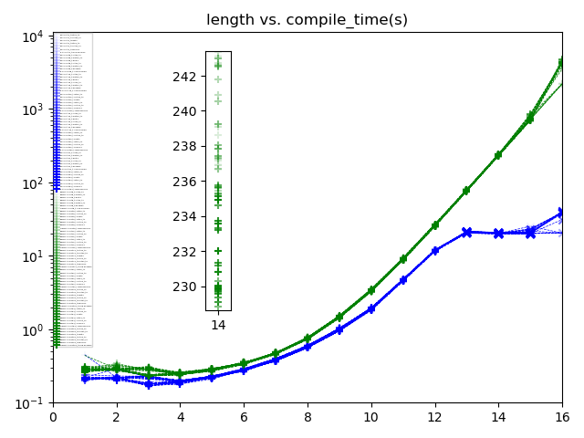
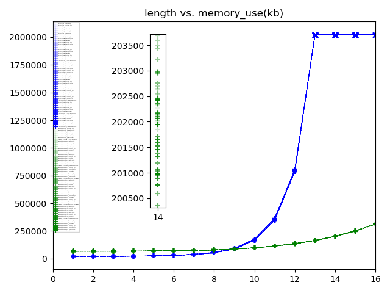

# Template SAW
Enumerate all (self avoiding) walks up to a certain length on a square lattice in C++ at compile time
```
/* By BC van Zuiden -- Boston,MA March 2019 */
/* Probably very buggy USE AT OWN RISK this will brick everything you own */
/* NOBODY but YOU is liable for anything that happened in result of using this */
/* WARNING: DON'T RUN THIS PROGRAM THIS WILL DESTROY YOUR COMPUTER AND/OR HOUSE */
/* Any copyrighted piece of code within this code is NOT mine */
/* Inclusion of that code is forced upon me by a scary anonymous guy with a gun*/
```
Feel free to reuse and contribute, pull requests are very welcome!
This code is (and forever will be) a work in progress.

### What and why
This program code implements an algorithm that recursively enumerates all (self avoiding) walks up to a certain length
This program is written in C++17.
I already did something similar [here](https://github.com/originalsouth/saw_bench) but this time the program only prints answers that are calculated during compilation.
What this means that the compiled binary is roughly given by this LLVM code (as generated by `clang++ -D__NMAX__=8 -Wall -Wextra -std=c++17 -O3 -flto -s -S ts.cc`:
```
@.str.1 = private unnamed_addr constant [9 x i8] c"%lu;%lu\0A\00", align 1
@str = private unnamed_addr constant [11 x i8] c"#N[1];Z[2]\00"
define dso_local i32 @main() local_unnamed_addr #0 {
  %1 = tail call i32 @puts(i8* getelementptr inbounds ([11 x i8], [11 x i8]* @str, i64 0, i64 0))
  %2 = tail call i32 (i8*, ...) @printf(i8* getelementptr inbounds ([9 x i8], [9 x i8]* @.str.1, i64 0, i64 0), i64 0, i64 1)
  %3 = tail call i32 (i8*, ...) @printf(i8* getelementptr inbounds ([9 x i8], [9 x i8]* @.str.1, i64 0, i64 0), i64 1, i64 4)
  %4 = tail call i32 (i8*, ...) @printf(i8* getelementptr inbounds ([9 x i8], [9 x i8]* @.str.1, i64 0, i64 0), i64 2, i64 12)
  %5 = tail call i32 (i8*, ...) @printf(i8* getelementptr inbounds ([9 x i8], [9 x i8]* @.str.1, i64 0, i64 0), i64 3, i64 36)
  %6 = tail call i32 (i8*, ...) @printf(i8* getelementptr inbounds ([9 x i8], [9 x i8]* @.str.1, i64 0, i64 0), i64 4, i64 100)
  %7 = tail call i32 (i8*, ...) @printf(i8* getelementptr inbounds ([9 x i8], [9 x i8]* @.str.1, i64 0, i64 0), i64 5, i64 284)
  %8 = tail call i32 (i8*, ...) @printf(i8* getelementptr inbounds ([9 x i8], [9 x i8]* @.str.1, i64 0, i64 0), i64 6, i64 780)
  %9 = tail call i32 (i8*, ...) @printf(i8* getelementptr inbounds ([9 x i8], [9 x i8]* @.str.1, i64 0, i64 0), i64 7, i64 2172)
  ret i32 0
}
;                                                                                                                          ^^^^^
;                                                                                                    the computed answers ===| 
```
and the actual calculation is done by the compiler, see the Wikipedia on [template meta-programming](https://en.wikipedia.org/wiki/Template_metaprogramming) for more information.

<details>
<summary>
Why? To have fun with template meta-programming :)
</summary>

Why? To be able to say I understand it

Why? Because I am a nerd

Why? Because I am bored

Why? Because I do not have a real job and I got to pass the time somehow

Why? Because fuck it, we are alone in the universe, nobody gives a shit about us

...

Why? Because some things are and some things are not, you cannot have fucking is not

Why? Well, because some things are and some things are not

Why? Well, because things that are not can not be

Why? Because then nothing would not be you cannot have fucking nothing is not everything is

Why? Because if nothing was not, there would be fucking all kinds of shit like giant ants with top-hats dancing around

Why? Oh fuck you, go eat your French fries, you little shit, god damn it

*Credits to Louis CK for this part*
</details>

### How
We use a recursive algorithm to enumerate the saw's.
We store the grid values into the variably sized template parameter packs functions.
Finally we extract the enumerated values with constant expressions. 
Just eyeball `ts.cc` and it will slowly start making sense.
A similar algorithm in your favorite language can be found [here](https://github.com/originalsouth/saw_bench).

### Then
OK you say, now what.

Well for starters let us see how efficient our C++17 compilers actually are and then plot the result.
We run:
```
./ts_compile.zsh | tee ts_compile.ls
./ts_plot.py
```




(see pdf's for better resolution)

Here we see **gcc** (blue) vs. **clang** (green) for many different data types and lengths (N).
I particular `gcc 8.2.1` vs. `clang version 7.0.1`.
Pluses are actual data points, crosses are crashed compilations.
As the complexity of the calculation scales with a<sup>N</sup>, where a is somewhere in the interval [2,3] we expect the compile time and memory use to scale with that.

We observe that if **gcc** compiles the code it typically does so faster (almost by a factor of two compared to clang) 
On the flip side because of **gcc**'s ridicules memory footprint **gcc** only successfully compiles N&lt;13.
Using `-fconstexpr-steps=-1` in clang we do get to compile up to N=17 after which we have hit **clangs** builtin maximum limit for the *constexpr step cap*.

We also observe that using smaller size types does not measurably change the compilation time or memory usage for both compilers.

### There is more
A weird bug/feature in `gcc 8.2.1` compiling with the `-Wextra` flag allows us spy at what the compiler is doing. 
The `-Wextra` enables `-Wunused-variable`, the `constexpr` on ts.cc:62 seems to cause a branch split which optimizes variables `u` and `v` out.
In turn `-Wunused-variable` then reports the variables `u` and `v` are unused producing warning messages that tells us how the template variables are called by one another.
This way you can see the whole call stack which can be useful as the portrays the whole algorithm neatly.
This feature is turned on by compiling with `-D__G_SPY__` flag.
Here we see an example for for one `N=4` walk (the full report is given in the "gcc_comp" file):
```
ts.cc: In instantiation of ‘static constexpr X walker<X, Y, x, y, n, N>::move(X, Y, Y, const Nodes ...) [with Nodes = {int, int, int, int}; X = unsigned int; Y = int; Y x = 7; Y y = 4; Y n = 3; Y N = 3]’:
ts.cc:65:75:   required from ‘static constexpr X walker<X, Y, x, y, n, N>::move(X, Y, Y, const Nodes ...) [with Nodes = {int, int}; X = unsigned int; Y = int; Y x = 6; Y y = 4; Y n = 2; Y N = 3]’
ts.cc:91:66:   required from ‘static constexpr X walker<X, Y, x, y, n, N>::move(X, Y, Y) [with X = unsigned int; Y = int; Y x = 5; Y y = 4; Y n = 1; Y N = 3]’
ts.cc:111:35:   required from ‘static constexpr X walker<X, Y, x, y, n, N>::move(X) [with X = unsigned int; Y = int; Y x = 4; Y y = 4; Y n = 0; Y N = 3]’
ts.cc:123:70:   required from ‘constexpr saw<X, Y, N>::saw() [with X = unsigned int; Y = int; Y N = 3]’
ts.cc:131:30:   required from ‘saws<X, Y, N>::saws() [with X = unsigned int; Y = int; Y N = 3]’
ts.cc:139:36:   required from here
ts.cc:54:65: warning: parameter ‘u’ set but not used [-Wunused-but-set-parameter]
     template<class...Nodes> static constexpr X move(X z,const Y u,const Y v,const Nodes...nodes)
```
Basically the walker walked as follows `(4,4) -> (4,5) -> (4,6) -> (4,7)` where it terminated as the max length was set by `N=3`.
I should probably write a script that extracts all the walkers from here but that is a task for another day :)

###Conclusion
To conclude the lessons we learned today can be neatly summarized:
* For `gcc 8.2.1` vs. `clang version 7.0.1` gcc compiles this heavily recursive algorithm much quicker if it compiles at all
* The memory used by `gcc 8.2.1` becomes huge for `__N_MAX__>11` (too large to handle for my rusty poor laptop).
* `clang version 7.0.1` with the flag `-fconstexpr-steps=-1` compiles up to `__N_MAX__=17` after which it refuses to compile due to a built in limit.
* Due to some feature/bug in `gcc 8.2.1` we can "spy" on the compilation process and see what the compiler (and thus the algorithm) is actually up to.
